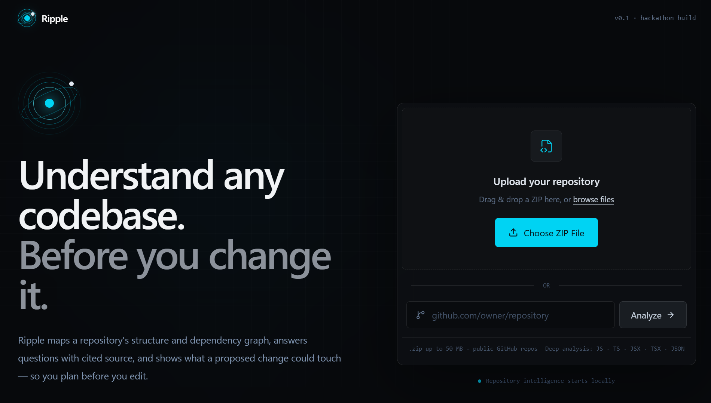
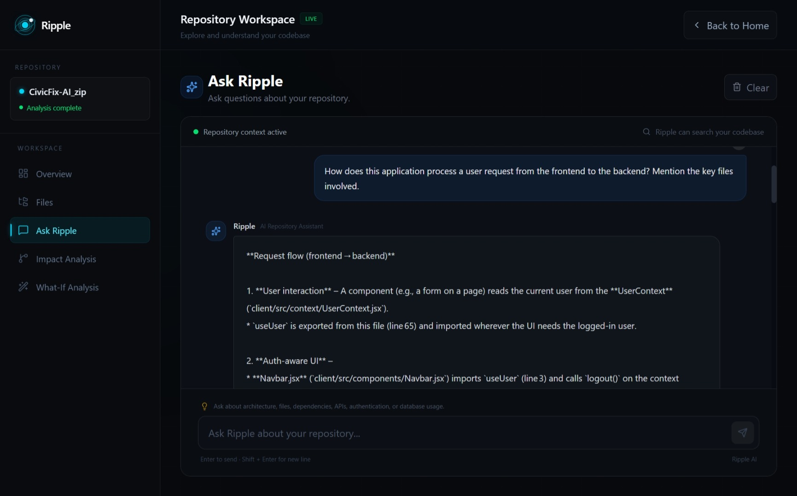
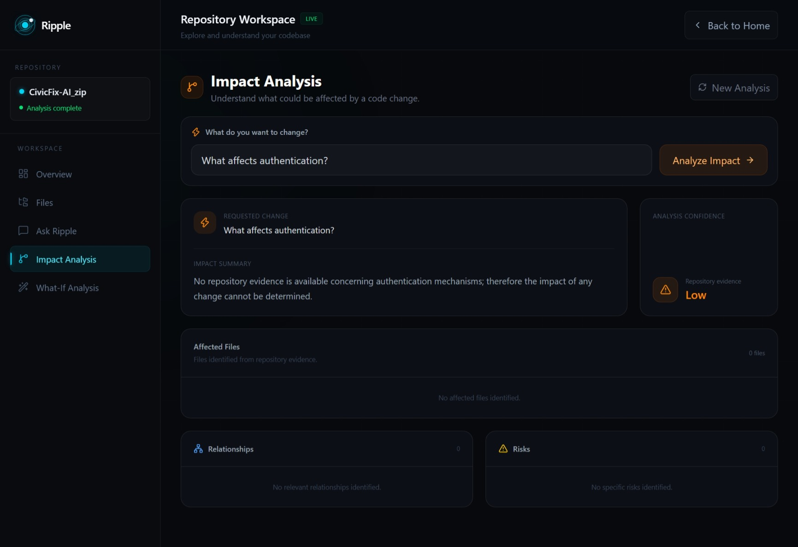
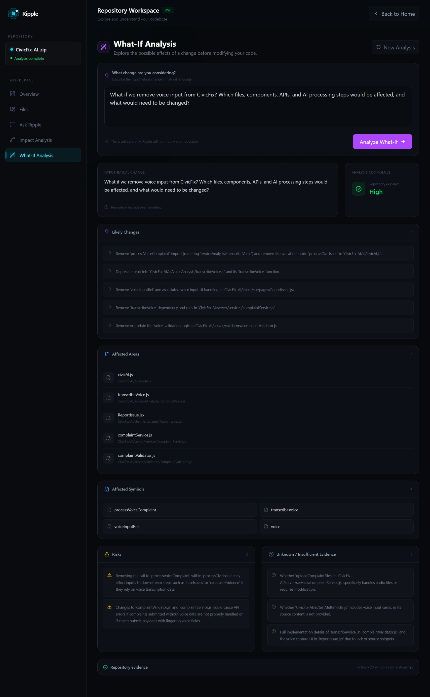

# Ripple AI

> **AI-powered repository intelligence for understanding codebases, analyzing change impact, and exploring What-If scenarios.**

Ripple AI helps developers understand unfamiliar repositories without manually tracing every file, dependency, and component.

Instead of asking an LLM to blindly read an entire codebase, Ripple first analyzes the repository and builds structured context. AI then reasons over that context to explain how the repository works and what could be affected by a proposed change.

---

## 🚀 What Ripple AI Does

Ripple provides four core capabilities:

## 🖥️ Product Preview

### Landing



### Ask Ripple



### Impact Analysis



### What-If Analysis



### 1. Repository Understanding

Analyze an unfamiliar repository and understand:

- Project structure
- Major modules and components
- File relationships
- Important implementation flows
- Frontend/backend interactions
- Relevant source files and symbols

### 2. Ask Ripple

Ask natural-language questions about the repository.

Examples:

- How does authentication work?
- What happens when a user submits a complaint?
- Where is this API implemented?
- Which files are involved in this feature?

Ripple answers using repository-specific evidence rather than generic programming knowledge.

### 3. Impact Analysis

Describe a proposed change and identify areas that may be affected.

For example:

> "What files would be affected if we change the complaint analysis logic?"

Ripple identifies relevant files and explains why they may be affected.

### 4. What-If Analysis

Explore hypothetical changes before modifying the codebase.

Examples:

- What if voice input is removed?
- What if priority calculation is removed?
- What if authentication changes?
- What if this service is split into two modules?

Ripple provides affected areas, considerations, risks, and an implementation plan.

---

## 🧠 How It Works

Ripple follows a **structured-analysis-first** approach.

```text
Repository
    │
    ▼
Repository Ingestion
    │
    ▼
Deterministic Analysis
    │
    ├── Files
    ├── Symbols
    ├── Relationships
    └── Repository Metadata
    │
    ▼
Relevant Context Retrieval
    │
    ▼
AI Orchestrator
    │
    ▼
OpenRouter LLM
    │
    ▼
Repository-Grounded Response
    │
    ▼
React Frontend
```

### Core Principle

> **Deterministic analysis establishes what exists. AI reasons about what it means.**

This helps Ripple reduce unsupported assumptions and keeps repository facts separate from AI interpretation.

---

## ✨ Key Features

- 📦 ZIP repository upload
- 🔗 Public GitHub repository analysis
- 🔍 Repository structure analysis
- 🧩 Symbol and relationship analysis
- 💬 Natural-language repository questions
- 💥 Change Impact Analysis
- 🔮 What-If Analysis
- 📋 Implementation plans
- 📁 Repository file references
- 🛡️ Sensitive-data filtering
- ⚠️ Graceful handling of partial analysis
- 🚫 No automatic code modification

---

## 🤖 AI Architecture

Ripple uses a single AI Orchestrator, rather than multiple autonomous agents.

User Request

     │

     ▼

AI Orchestrator

     │

     ▼

Relevant Repository Context

     │

     ▼

OpenRouter API

     │

     ▼

nvidia/nemotron-3.5-lightning:free

     │

     ▼

Structured AI Result

The AI layer is responsible for:

Understanding repository context
Explaining architecture
Answering questions
Interpreting relationships
Explaining potential impact
Reasoning about hypothetical changes
Generating implementation guidance

The deterministic analysis layer remains responsible for repository facts.

---

## 🎯 Impact Analysis

Impact Analysis combines repository evidence with AI reasoning.

```text
Proposed Change
      │
      ▼
Relevant Repository Areas
      │
      ▼
Repository Evidence
      │
      ▼
AI Reasoning
      │
      ▼
Affected Areas
      │
      ▼
Implementation Considerations
```

Ripple distinguishes between directly affected areas, indirectly affected areas, and areas that may require further investigation.

It does **not** claim that an inferred dependency is a confirmed repository fact.

---

## 🔮 What-If Analysis

What-If Analysis lets developers explore a change without actually applying it.

```text
Hypothetical Change
        │
        ▼
Relevant Repository Context
        │
        ▼
Affected Areas
        │
        ▼
AI Reasoning
        │
        ▼
Considerations
        │
        ▼
Implementation Plan
```

Ripple does not:

- Modify repository files
- Create commits
- Create pull requests
- Push changes

The developer remains in control of the actual implementation.

---

## 🛡️ Security & Sensitive Data

Repository analysis may encounter sensitive information such as:

- API keys
- Access tokens
- Passwords
- Credentials
- `.env` values
- Private secrets

Ripple applies security filtering before sensitive content is exposed to the AI layer or returned through user-facing responses.

Detected sensitive values are protected rather than intentionally passed into AI context.

---

## ⚠️ AI Token & Request Limits

Ripple currently uses the OpenRouter API with the nvidia/nemotron-3.5-lightning:free model.

Large repositories or complex questions can produce large AI contexts. Depending on repository size, retrieved context, and current provider availability, AI analysis may take some time to generate a response or may encounter provider rate limits.

Response generation time can vary, especially for Impact Analysis and What-If Analysis, because Ripple first retrieves and processes relevant repository context before sending it to the AI model. This repository-grounded analysis may take longer than a simple AI chat request.

Ripple handles AI failures gracefully instead of exposing raw provider errors to the user. For example, provider rate-limit or token-limit failures are converted into user-friendly messages asking the user to shorten the request or retry later.

The deterministic repository analysis remains available even when an AI request cannot be completed.

---

## 🌐 Language Support

Ripple is designed to accept different repository types.

The MVP provides its deepest structural analysis for:

- JavaScript
- TypeScript

Repositories containing unsupported languages are handled gracefully where possible, with available repository metadata and warnings about analysis limitations.

Ripple does not claim deep structural understanding when the underlying analyzer cannot establish it.

---

## 🏗️ Technology Stack
Layer	Technology
Frontend	React, Vite
Backend	Node.js, Express.js
AI	OpenRouter API
AI Model	nvidia/nemotron-3.5-lightning:free
Repository Input	ZIP / Public GitHub
Deployment	Vercel + Railway
Language	JavaScript

---

## 📂 Project Structure

```text
Ripple/
├── client/          # React + Vite frontend
├── server/          # Node.js + Express backend
├── analysis/        # Repository analysis engine
├── docs/            # Public technical documentation
├── README.md
└── package.json
```

---

## 🔄 Repository Analysis Flow

```text
Upload / GitHub Repository
          │
          ▼
    Repository Ingestion
          │
          ▼
     File Discovery
          │
          ▼
   Structural Analysis
          │
          ▼
  Repository Representation
          │
          ▼
   Context Retrieval
          │
          ▼
      AI Analysis
          │
          ▼
   Ripple Response
```

---

## 📚 Documentation

Additional technical documentation:

- `docs/architecture.md` — System architecture and major component responsibilities
- `docs/ai_spec.md` — AI reasoning, context, grounding, and guardrails
- `docs/api_contract.md` — Frontend/backend API contract

---

## 🚀 Live Demo

**Frontend:**
https://ripple-rosy-seven.vercel.app

**Backend Health Check:**
https://ripple-production-1909.up.railway.app/api/health

---

## 💻 Local Development

### 1. Clone the repository

```bash
git clone https://github.com/Rohan7207/Ripple.git
cd Ripple
```

### 2. Install dependencies

```bash
cd server
npm install

cd ../client
npm install
```

### 3. Configure environment variables

Configure the required backend AI credentials and frontend API base URL.

Do not commit `.env` files or API keys to the repository.

### 4. Start the backend

```bash
cd server
npm start
```

### 5. Start the frontend

```bash
cd client
npm run dev
```

---

## 🎯 MVP Boundary

Ripple's current MVP focuses on **repository intelligence**, not autonomous coding.

### Included

- Repository understanding
- Ask Ripple
- Impact Analysis
- What-If Analysis
- Repository-grounded AI reasoning
- Evidence and source references
- Implementation guidance
- Sensitive-data protection
- Graceful AI failure handling

### Not Included

- Automatic code modification
- Automatic commits
- Automatic pull requests
- Autonomous repository maintenance
- Multi-agent orchestration
- Long-running autonomous coding tasks

---

## 🧩 Why Ripple?

Traditional code search helps developers find files.

General-purpose AI assistants can explain code.

**Ripple combines repository analysis with AI reasoning** to help developers understand how a change can propagate through an unfamiliar codebase before they make that change.

> **Understand the repository. Trace the impact. Explore the change.**

---

## 👥 Project

**Ripple AI**
AI-powered repository intelligence for developers and engineering teams.

GitHub:
https://github.com/Rohan7207/Ripple
